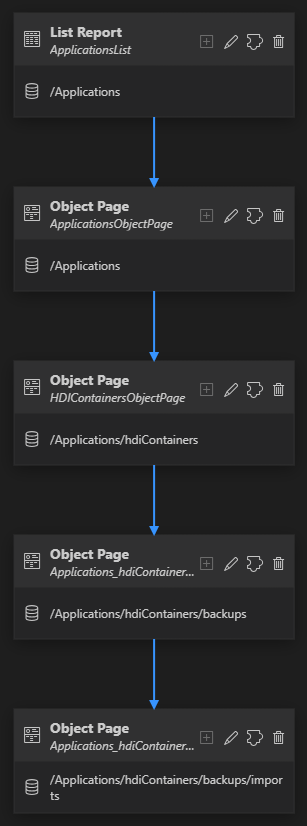
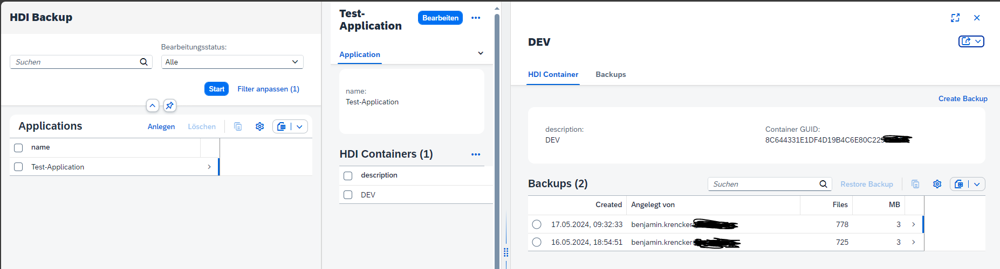
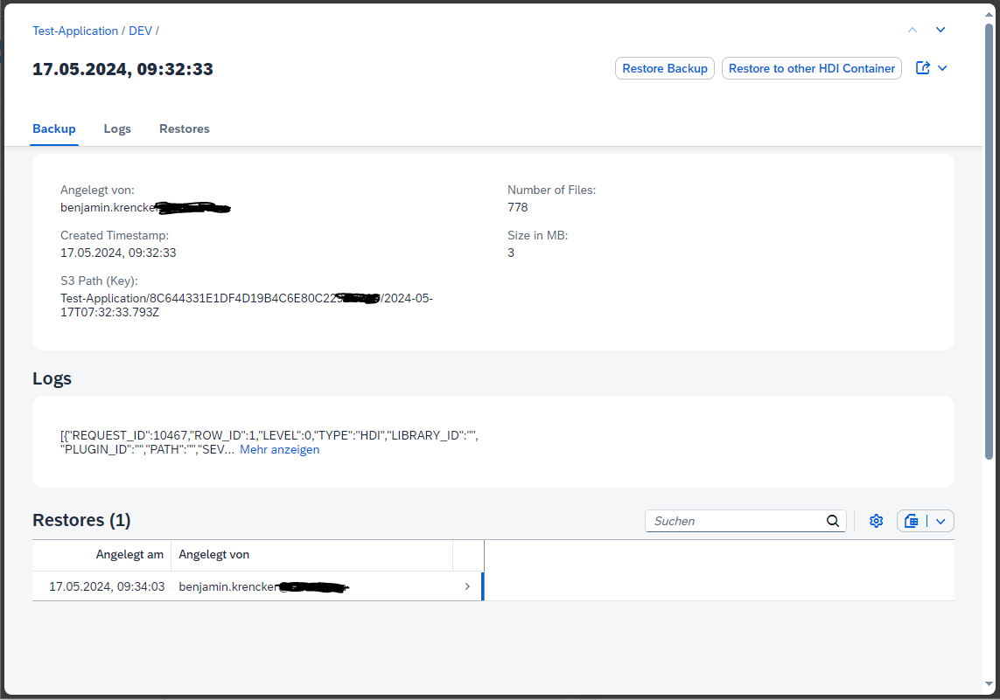
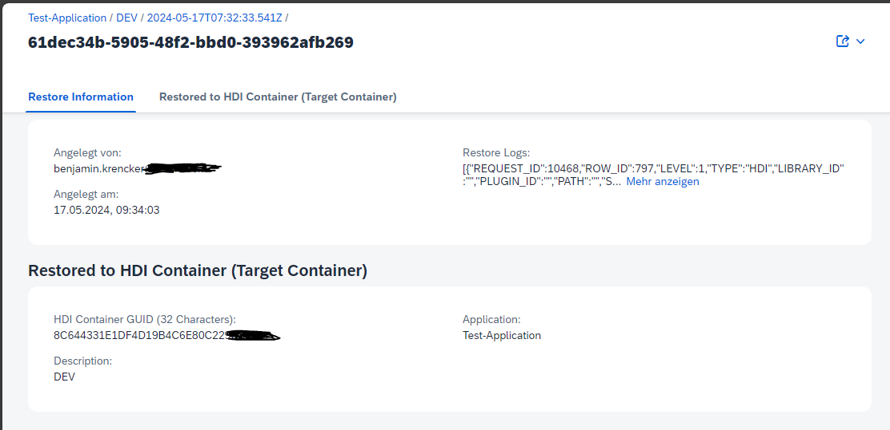
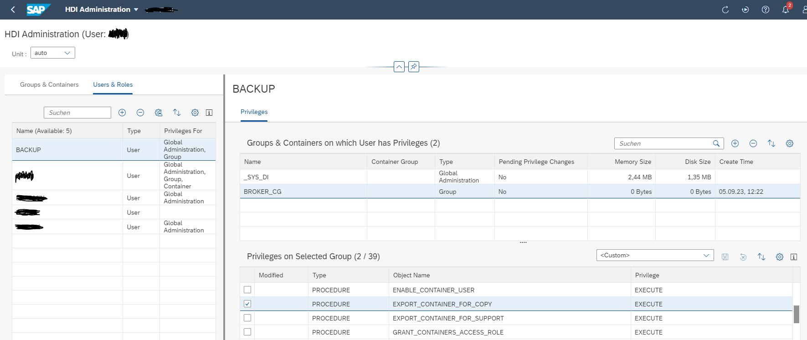
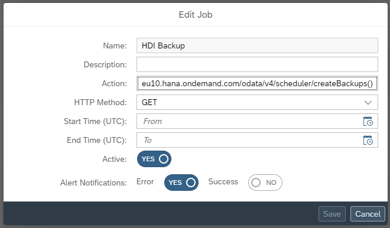
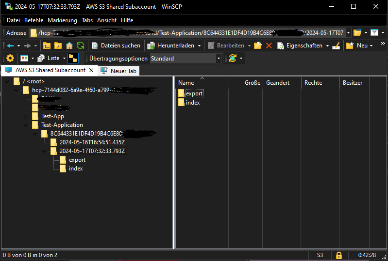

# BTP Toolbox: HDI Container Backup & Restore (Export / Import)

This is the first application for a Toolbox that helps running & operating `Cloud (CAP) Apps` on SAP BTP.

## App Motivation

We have several productive CAP applications running on BTP using Hana Cloud as Database. Recently, we had a case where some data was lossed during CAP deployment. 

We checked the possibilities for Data Restore on BTP Hana DB via OSS-Ticket and SAP Support. It is not easy to restore just a single HDI Container because the whole Database is restored. You can restore it to a new Instance (via OSS Ticket) tough and extract Data from there, but this is not an easy workflow and depending on SAP Support.

Therefore we looked for other options and since we can Export / Import HDI Containers manually from the Hana Database Explorer, we aimed to automate this process.

That's why I developed a CAP Application, which can `Export (Backup) and Import (Restore) HDI Containers` through a Fiori Elements UI. The Backups are stored on AWS S3 ObjectStorage (from a BTP Service), which gives us full control over the backups.

It is also possible to completely `automate the creation of the Backups through Cloud Scheduling Service` on BTP. For example creating nightly backups of all productive HDI Containers.

And as `one more thing` this App can also be used for `HDI environment copy (data from PROD to QAS / DEV)` because you can choose to which target HDI Container you wand to restore a backup.

Feel free to use this project for your own use case and to submit a Pull Requests to add more features.

## Functionality

The data structure inside the application is a follows with one-to-many cardinality (top-down):
```
  Applications      : on this level you can add your BTP application names
    HDI Containers  : here you fill the HDI Container IDs
      Backups       : every backup creates an entry here storing AWS object key & logs
        Restores    : after a restore a new entry here is created storing target HDI Container & logs
```

Fiori Elements Page Map:



Overview of the List Report:



Overview of a Backup. Every backup created a new entry.



Overview of a Restore. Every restore creates a new entry.



## Project Structure

This project is following the recommended project layout for CAP applications:

File or Folder | Purpose
---------|----------
`app/` | content for UI frontends goes here
`db/` | your domain models and data go here
`srv/` | your service models and code go here
`package.json` | project metadata and configuration
`readme.md` | this getting started guide
`.env` | Manually create this file containing the Environment Variables to connect to Hana DB as BACKUP user
`test/data/` | Sample data file which is only used when running locally

## Setup Application for running on BTP

### Summary

- Build and deploy the project to your CF environment to create all the necessary instances
- Setup Hana DB: Import AWS Certificate, create BACKUP-User, grant HDI Privileges
- Make a test if you can export and import a HDI Container manually from the SAP Hana Database Explorer
- Ready to use the CAP Application
- Local running possible after deployment and `npm run bindObjectstore`. Also create a .env file containing the Environment Variables (see below). Then run `cds watch --profile hybrid`. Login with user `alice`.

### Hana DB: Import Certificate
Login to Hana DB as `DBADMIN`and follow this Blog to create and import the Certificate.
[Export/Import an SAP HDI Container for Copy Purposes to a Cloud Store](https://community.sap.com/t5/technology-blogs-by-sap/export-import-an-sap-hdi-container-for-copy-purposes-to-a-cloud-store/ba-p/13559291)

The OpenSSL Command I used was following this pattern. Use the Bucket Name and Host from CF Instance Binding.
OpenSSL> s_client -host `<S3 Bucket>.<S3 Host>` -port 443 -prexit -showcerts

For example:
```
OpenSSL> s_client -host hcp-xxxyyzzzzzzz.s3-eu-central-1.amazonaws.com -port 443 -prexit -showcerts
```

### Hana DB: Create a HDI Admin User

If not yet existing, create a User which has HDI Administration Privileges. A good starting point is following Blog:

[HDI Container Administration](https://github.com/SAP-samples/btp-cap-multitenant-saas/blob/main/docu/4-expert/hdi-container-administration/README.md)

### Hana DB: Create BACKUP User

Login as `DBADMIN` on the Hana DB and create a `BACKUP` User.

### Hana DB: Grant HDI Privileges to BACKUP User

Login as `HDI Admin User` on the Hana DB and go to HDI Administration.

Switch to tab `Users & Roles` and add `BACKUP` User.

Then select `BACKUP` User and add the HDI Container Group `BROKER_CG`.

Then select `BROKER_CG` Container Group and set privileges `EXPORT_CONTAINER_FOR_COPY` and `IMPORT_CONTAINER_FOR_COPY`.

Then press `SAVE` and you should see following output:
```
Selected privileges successfully granted to BACKUP on BROKER_CG

Details:

Granting API privileges in the container group "BROKER_CG" and the parameters "[]"...
Granting the API privilege "EXECUTE" on the object "EXPORT_CONTAINER_FOR_COPY" in the schema "_SYS_DI#BROKER_CG" to the principal "BACKUP" in the schema "" with grant option = "false"
Granting the API privilege "EXECUTE" on the object "IMPORT_CONTAINER_FOR_COPY" in the schema "_SYS_DI#BROKER_CG" to the principal "BACKUP" in the schema "" with grant option = "false"
Granting API privileges in the container group "BROKER_CG" and the parameters "[]"... ok
```

Screenshot



*Note that `BROKER_CG` contains all HDI Containers on the Hana DB. If you prefer to restrict access to only certain HDI Containers, create a separate Container Group and add only selected HDI Containers.*


### App: Environment Variables

When running locally create `.env` File with following variables to connect with `BACKUP` User to the Hana DB Instance.
As Hostname use the `SQL Endpoint` which is listed on the Hana Cloud Instance Dashboard.

```
cds.requires.hanadb.credentials.host=<Hana DB Connection String>
cds.requires.hanadb.credentials.user=<Hana DB Username>
cds.requires.hanadb.credentials.pw=<Hana DB Password>
```

## Automate Backup Creation using BTP Job Scheduler

The `mta.yaml` file of this project will already create a BTP Scheduler instance.

After deployment to BTP, make sure you assign the Scheduler Administrator role to your user.

Then, you can create a new scheduled job.



Make sure to activate the checkbox on the HDI Container. Only flagged HDI Containers will have a backup created from scheduler calls.


## Tips and Tricks

### Access S3 Storage using WinSCP

It is possible to use WinSCP to access the Bucket on S3 storage. Follow the following instructions. I recommend to create a new ServiceKey on objectstore instance on BTP for the access.

The Backup Application creates a new folder for every Application and a subfolder for HDI Containers. There all backups are saved.



[Use WinSCP to access S3 Store](https://community.sap.com/t5/technology-blogs-by-sap/how-to-access-an-btp-object-store-aws-s3-bucket-from-local-desktop/ba-p/13552292)


## Learn More

[Export/Import an SAP HDI Container for Copy Purposes to a Cloud Store](https://community.sap.com/t5/technology-blogs-by-sap/export-import-an-sap-hdi-container-for-copy-purposes-to-a-cloud-store/ba-p/13559291)

[Use WinSCP to access S3 Store](https://community.sap.com/t5/technology-blogs-by-sap/how-to-access-an-btp-object-store-aws-s3-bucket-from-local-desktop/ba-p/13552292)

[HDI Container Administration](https://github.com/SAP-samples/btp-cap-multitenant-saas/blob/main/docu/4-expert/hdi-container-administration/README.md)

[CAP Attachment Plugin](https://github.com/cap-js/attachments/blob/main/README.md)

